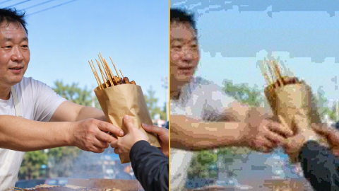
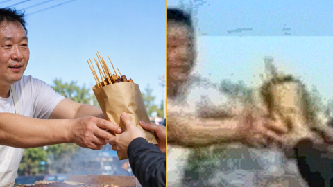
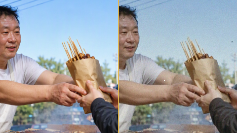
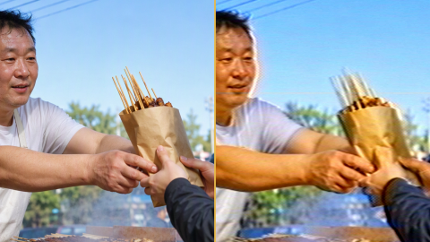
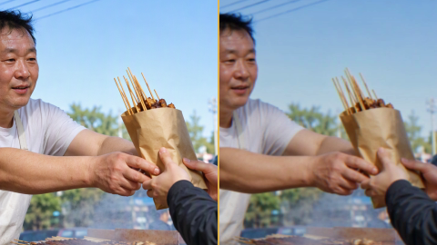
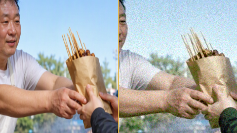
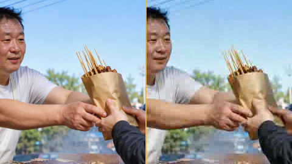
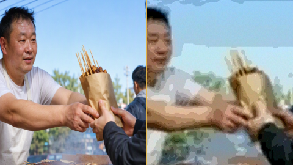
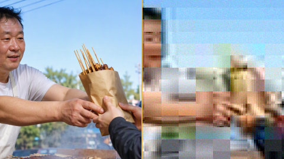
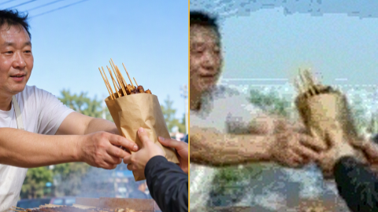

# Rewind

中文说明:**[README_zh.md](README_zh.md)**

Rewind degrades video and images so they look like period media: VHS tape, CRT television,
8 mm film, CCTV recording, dubbed DVD, fansub RMVB, 3GP phone video, screen re-photography, and
the recompressed look of a picture that has been re-uploaded many times. An era axis covers
1965–2026 and compiles a preset for any year.

Everything runs locally: no upload, no account, no telemetry, no outbound requests. The bundled
web server listens on `127.0.0.1` only.

Every output file records in its metadata that the effect is synthetic. See
[Provenance](#provenance).

MIT licensed; third-party terms in [License](#license-and-third-party).

## Running it

Build needs Rust stable (edition 2024) and ffmpeg ≥ 4.4.

```bash
cd core && cargo build --release        # produces ./core/target/release/rewind-core
./webui.sh                              # local web UI at http://127.0.0.1:8137/
./webui.sh --rebuild                    # build the engine first, then serve
```

`webui.sh` checks for the engine binary and for `ffmpeg`/`ffprobe` on `PATH`, and prints what to
do if either is missing.

The web UI is the same front end as the desktop app. Files added in a browser are uploaded over
loopback (`POST /upload`) and written to disk on the same machine; the server only serves files
from an allow-list.

Desktop app:

```bash
cd app && cargo build                   # Tauri 2: webkit2gtk-4.1 on Linux, WebView2 + MSVC on Windows
```

## CLI

```bash
B=./core/target/release/rewind-core

$B run     --preset presets/dvd2005.json --input assets/sample/street-food.mp4 --out-dir out/  # → out/street-food_dvd2005.mp4
$B run     --preset presets/cctv2000.json --input in.mp4 --out-dir out/ \
           --override resize.dar=4:3 --override fps.fps=12.5   # overrides in memory; preset JSON untouched
$B batch   --preset presets/patina.json --out-dir out/ a.mp4 b.mp4 c.mov
$B era     1988 --write my88.json                              # compile any year into a preset
$B reclip  --input out/street-food_dvd2005.mp4 --times 2       # two more dubbing generations
$B preview --preset presets/vhs1990_ntscrs.json --input in.mp4 --out-dir p/ --t 3
$B describe                                       # parameter manifest the UIs render from
$B plan    --preset presets/patina.json --input in.mp4         # compiled filter plan
```

Subcommands: `run` `era` `reclip` `preview` `reroll` `describe` `preset-save` `preset-rename`
`batch` `serve` `probe` `sample` `presets` `catalog` `plan` `samples` `sweep-temps`.

Images are accepted too (`png`, `jpg`): temporal stages are skipped.

## Presets

Each image is a 1:1 centre crop of one frame — original left, degraded right, same source and
same pipeline. They are cropped, not scaled, because downscaling averages away the scanlines and
macroblocks being shown. Baked offline from one reference frame: `bash scripts/preset_gallery.sh`.

| Preset | Original / degraded, same frame |
|---|---|
| **Patina** (default) · ~2016 · 电子包浆 — recompressed, clipped highlights |  |
| **Blurred high** · ~2013 · 抽象高糊 — re-encoded until detail is gone |  |
| **8 mm film** · ~1970 · 老胶片 — gate weave, scratches, lifted blacks |  |
| **VHS** · ~1990 · 家用录像带 — two implementations: `ntsc-rs` signal-level, static approximation |  |
| **CRT** · ~1995 · 大屁股 CRT — phosphor, scanlines, curvature |  |
| **CCTV** · ~2000 · 监控录像 — 4:3, low bitrate, burned-in timestamp |  |
| **Dubbed DVD** · ~2005 · 网吧翻录 DVD — mpeg4 macroblocking, interlace comb |  |
| **RMVB fansub** · ~2006 · 字幕组 RMVB — thin bitrate, banding on hardsubs |  |
| **3GP phone** · ~2010 · 彩屏手机 — small frame, heavy chroma loss |  |
| **Screen re-photography** · ~2011 · 屏摄翻拍 — moiré, keystone, backlight colour |  |

## Parameters

Two knobs cover most use:

- **Intensity** `0.2–2.0` — scales effect amplitude, does not change the era.
- **Generations** `1–8` — the dubbing ladder. One generation: downscale to 0.72× on the long
  edge, one codec round trip, chroma decimation, dropouts, haze. From 6, sharpening and
  saturation go into the over-cranked tier. The final pass returns to the source canvas, so this
  knob does not change export size. The ceiling is 8: round trips at fixed size and quality
  converge.

**Colour cast** is off by default.

The rest is in the advanced panel: 12 groups, 75 parameters, one control each. The UI is built
from `rewind-core describe`, so adding a parameter to the manifest adds its control to both the
desktop and the web interface. Overrides are sent as `--override stage.key=value` and never
rewrite a preset file; an unknown name fails and lists the valid ones.

The manifest separates the range a slider offers from the range the engine accepts, so a
hand-written preset with an extreme value still renders.

## Layout

```
core/     rewind-core: CLI and local web server. Preset → step plan → executor.
          FastPath chains ffmpeg passes; PixelPath streams rawvideo through in-process
          pixel ops and the vendored ntsc-rs signal simulator.
shell/    rewind-shell: GUI-free protocol layer. Spawns core as a sidecar, parses NDJSON
          events, owns queueing, cancellation and settings. Compiles and tests without a
          display or webview.
app/      Tauri 2 shell (214 lines over rewind-shell); app/ui is shared with the web build.
presets/  Built-in presets, schema v1, read-only.
fixtures/ Synthetic gate inputs (ffmpeg lavfi; no third-party rights).
assets/   Brand icons, sample media, gallery reference, each with CREDITS notes.
scripts/  Gates and asset bakers.
vendor/   ntsc-rs, vendored as source, with its upstream licence texts.
docs/     Design record and milestone ledger (Chinese).
```

## Tests

```bash
cd core  && cargo test     # 83
cd shell && cargo test     # 14
```

Gate suite, all wired into CI (Linux, Windows, macOS) via `.github/workflows/build.yml`. Run
them one at a time: they share ports and the preview cache, so failures from concurrent runs
are not meaningful.

| Gate | Checks | Count |
|---|---|---|
| `regression.sh` | every preset × every era step, batch, preview, image mode on even and odd canvases, watermark, audio, temp-file residue, web upload, gallery assets, progress readout, ENOSPC, drive-letter font paths | 95 |
| `geo_check.sh` | DAR/SAR/crop contract: comparison layers share geometry, delivery aspect is baked into pixels | 59 |
| `aging_check.sh` | generation ladder: no step gets newer, ≥5 of 7 steps strictly worse, 1-to-8 SSIM drop >0.30, canvas invariant, phase change at 6, deterministic | 28 |
| `safe_max.sh` | no inverted ranges, rejections readable, legal extremes still render | 23 |
| `ntsc_check.sh` | 12 signal knobs: defaults change nothing, each changes the picture, out-of-range coded | 21 |
| `conc_check.sh` | concurrent previews and runs do not collide on temp or output names | 10 |
| `param_liveness.py` | all 75 parameters leave a trace in the compiled plan | 156 plan diffs |
| `param_pixels.py` | each visual parameter, moved alone, changes the rendered frame | 60 pairs, 15 exemptions with reasons |
| `param_audio.py` | each audio parameter, moved alone, changes the finished track | 15 pairs |
| `preset_variance.sh` | no two presets are the same look (structure + colour, high-frequency energy, blockiness, chroma dispersion) | 11 presets |
| `axis_check.sh` | frame-rate and aspect axes, quantitative | assertions |
| `preset_gallery.sh --check` | four gallery assets per preset | 11 presets |
| `i18n_check.js` | zh/en key parity, English text for every engine string, error codes decodable both ways | 25 |
| `release_check.sh` | licence, notices, version parity, assets in the index, gate and CI completeness, README completeness, repo hygiene, BSD/GNU tool-portability of the gates | 96 |

Three levels of liveness, because a control can break at any of them: the value does not reach
the plan, the plan does not change the pixels, or the change is audio-only and frame hashes
cannot see it.

## Performance

`assets/sample/street-food.mp4` (8 s, 1280×720, 30 fps), whole clip, one run, WSL2 with 12
cores, ffmpeg 4.4.2. Reproduce any row with:

```bash
./core/target/release/rewind-core run --preset presets/patina.json \
    --input assets/sample/street-food.mp4 --out-dir out/
```

| Preset | Time | vs realtime | Output |
|---|---|---|---|
| CCTV 2000 (FastPath, 1 pass) | 1.8 s | 4.4× | 8.6 MB |
| Dubbed DVD 2005 (FastPath, 2 passes) | 2.4 s | 3.3× | 2.9 MB |
| VHS signal-level | 4.1 s | 2.0× | 14 MB |
| CRT 1995 | 4.8 s | 1.7× | 1.6 MB |
| Patina (2 generations) | 5.0 s | 1.6× | 7.2 MB |
| 8 mm film 1970 | 6.9 s | 1.2× | 2.9 MB |

Speed depends on whether a preset stays on FastPath (ffmpeg only) or needs PixelPath (raw frames
in Rust), and on how noisy the source is: temporary files in multi-pass runs grow with pixel
entropy, not with source file size.

## Error codes

Failures have the form `[code] reason`. Chinese UI shows the reason; English UI translates by
code. Report the code alone in issues. Table: `core/src/errcode.rs`, 20 codes.

| Code | Meaning |
|---|---|
| `engine.spawn`, `engine.ffprobe` | ffmpeg/ffprobe not found, or the media cannot be decoded. Put them on `PATH` or set `REWIND_FFMPEG` / `REWIND_FFPROBE` |
| `engine.disk_full` | Disk filled during a run. Failing passes delete their partial file |
| `param.range`, `param.unknown` | Override out of bounds, or name does not exist. `describe` lists both ranges and names |
| `engine.output` | Engine or ffprobe output unparseable: usually a version mismatch or a replaced binary |
| `run.canceled` | Cancel was pressed. Not an error; the UI shows no failure |

## Limitations

- Desktop GUI has not been smoke-tested and no installers are published. CI compiles `app/`.
- Changing the delivery aspect crops by default. For the squashed look, set `fit=stretch`.
- No disk pre-flight. Measured peak temporary usage ranges from 0.6× to 67.7× the input size.
- Cancellation stops the engine; the ffmpeg pass already running finishes its current pass
  (2–4 s measured). Temporary files are removed by the parent process.
- Estimates before the first run come from a 1–1.5 s preview window and are 1.6–7× pessimistic;
  after one run with the same parameters, the measured value is used.
- HDR and variable-frame-rate sources are reported and warned about, not converted.
- Region/broadcast-format axes and time-based damage events are designed, not implemented.
- An ffmpeg build without the `drawtext` filter (some Homebrew variants) renders those presets without
  the burned-in timestamp; the rest of the chain is unaffected.

Environment overrides: `REWIND_CORE`, `REWIND_FFMPEG`, `REWIND_FFPROBE`, `REWIND_FFMPEG_DIR`,
`REWIND_PRESETS`, `REWIND_USER_PRESETS`, `REWIND_UI`, `REWIND_CONFIG`, `REWIND_UPLOAD_DIR`,
`REWIND_PORT`, `REWIND_FONT`, `REWIND_PREVIEW_DIR`, `REWIND_PREVIEW_MAX_EDGE`,
`REWIND_PREVIEW_MAX_MB`, `REWIND_SAMPLE`.

## Provenance

Each output writes a container metadata note:

```
Rewind v0.1.0 · 本文件经 Rewind 做旧处理(合成年代效果,非原始素材) · rewind.local
```

It cannot be disabled. You are responsible for the rights to the material you process and for
how the result is used.

## License and third party

- Rewind: MIT (`LICENSE`).
- FFmpeg: invoked as a subprocess, not linked. If a bundle ships FFmpeg binaries, their
  GPL/LGPL texts and source location ship with them. Full list of obligations: `THIRD-PARTY-NOTICES.md`.
- `ntsc-rs` (`vendor/ntsc-rs`): MIT OR ISC OR Apache-2.0.
- Tauri 2: MIT OR Apache-2.0.
- ALH Pro was read for its architecture and engineering notes; no code is used (proprietary,
  excluded by `.gitignore`). Same for composite-video-simulator (GPL-2.0) and vhs-decode
  (GPL-3.0): parameter semantics only.
- History in `CHANGELOG.md`.
